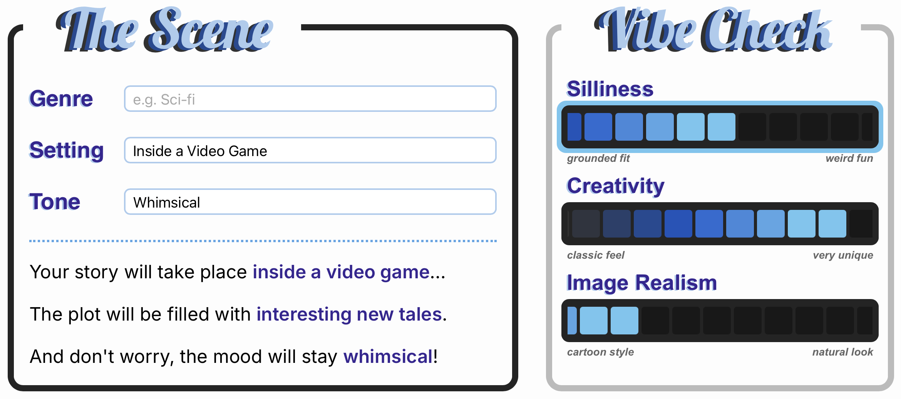
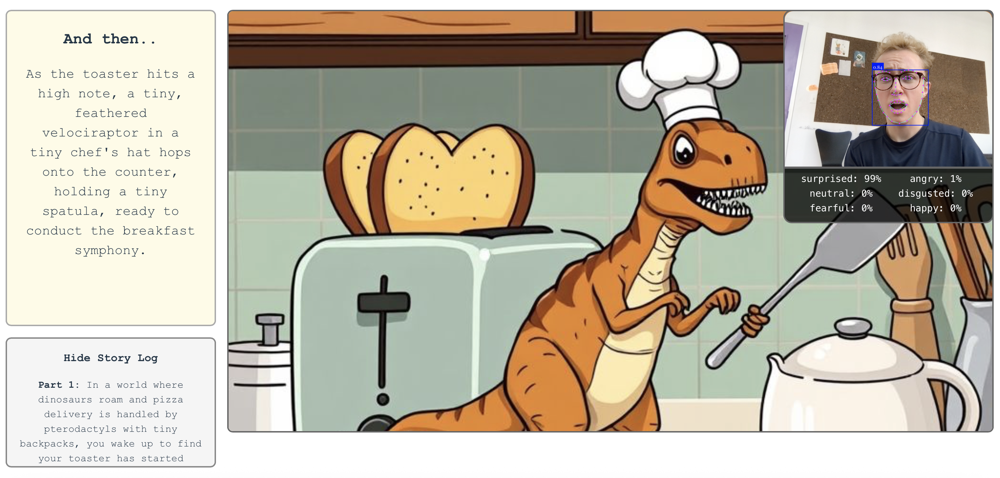

# 📖🎭 Choose Your [LLM Face] Adventure

## Description

Introducing... a **choose your adventure** game! Where the story is _entirely LLM-written_, and YOUR _facial expressions_ guide the process! 

This site is **LIVE**, so go check it out ——>  **[https://aadriien.github.io/choose-your-llm-face-adventure](https://aadriien.github.io/choose-your-llm-face-adventure)** 

## How It Works

You'll start by curating the story. Whether you're itching for some comedic whimsy, or otherwise want a calming slice of life, all are within reach. It's meant to be highly customizable, so have fun with it! 

With your selections in place, the storytelling process will begin. Your face will be tracked by the camera and displayed on the screen, outlining your facial landmarks and analyzing your expressions for key emotions. 

The faces you make will factor into the vibe you set up at the start, and the LLM will generate new pieces of the story (both text and image!) at each step. Be sure to scroll through your story log to review the full history, and to revisit each image you saw along the way!

## Tools / Tech

1. **Svelte (+ Vite)**: web framework
2. **face-api.js**: computer vision (TensorFlow core)
    - facial detection
    - facial expressions
    - facial landmarks
3. **HTML, JavaScript**: web helpers
4. **CSS**: web styling

## Example Images

🧮 Vibe Curation   |   📜 Story View  
:-------------------------:|:-------------------------:
  |  

